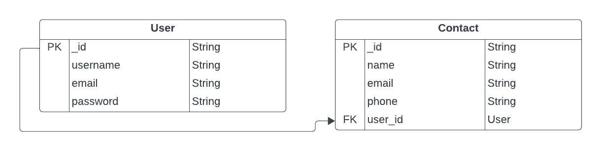

# Contact Management System

This is a simple contact management application that allows authenticated users to manage their contacts. The application is built with Node.js, Express, Typescript, and MongoDB. The backend handles user authentication, and authenticated users can perform the CRUD (Create, Read, Update, Delete) operations on their contacts.

## Table of Contents

- [Entity Relationship Diagram](#entity-relationship-diagram)
- [Features](#features)
- [Getting Started](#getting-started)
- [Project Folder Structure](#project-folder-structure)
- [API Reference](#api-reference)
- [Technologies Used](#technologies-used)

## Entity Relationship Diagram



## Features

- User authentication using JWT (Json Web Token)
- Password encryption using bcrypt
- CRUD operations for contacts
- Environment configuration using dotenv
- Database connection with MongoDB via Mongoose

## Getting Started

**Prerequisites**

- node `^19.2.0`
- npm `^9.2.0`

Make sure you have [npm](https://www.npmjs.com/get-npm) installed globally.
To get started with the project, follow the steps below:

#### 1.Clone the repository:

```bash
$ git clone git@github.com:roshanbist/contactManagement.git
$ cd contactManagement
```

#### 2.Install dependencies:

```bash
$ npm install    # Install project dependencies
```

#### 3.Set up environment variables

```bash
PORT=your_server_port_address
MONGO_URI=your_mongodb_uri
JWT_SECRET=your_jwt_secret
```

#### 4.Run the application in development mode:

```bash
$ npm run dev
```

The API will now be running on http://localhost:${PORT}.

## Project Folder Structure

```
└── 📁src
    └── 📁controllers
        └── contactsController.ts
        └── InvalidRouteController.ts
        └── userController.ts
    └── 📁middleware
        └── errorHandlerMiddleware.ts
        └── validateTokenMiddleware.ts
    └── 📁model
        └── ContactModel.ts
        └── UserModel.ts
    └── 📁routes
        └── contactsRoutes.ts
        └── userRoutes.ts
    └── 📁services
        └── contactsService.ts
        └── userService.ts
    └── 📁types
        └── all.ts
        └── express.d.ts
    └── 📁utils
        └── asyncErrorHandler.ts
        └── AuthUtil.ts
        └── CustomError.ts
        └── passport.ts
    └── app.ts
    └── server.ts
```

## API Reference

## User API

#### Register a new user

```http
  POST /api/v1/users/register
```

| Parameter  | Type     | Description                             |
| :--------- | :------- | :-------------------------------------- |
| `username` | `string` | **Required**. Username of the new user. |
| `email`    | `string` | **Required**. Email of the new user.    |
| `password` | `string` | **Required**. Password of the new user. |

#### Login a user

```http
  POST /api/v1/users/login
```

| Parameter  | Type     | Description                                |
| :--------- | :------- | :----------------------------------------- |
| `email`    | `string` | **Required**. Email for authentication.    |
| `password` | `string` | **Required**. Password for authentication. |

## Contact API

#### Get all contacts

```http
  GET /api/v1/contacts
```

| Parameter       | Type     | Description                               |
| :-------------- | :------- | :---------------------------------------- |
| `Authorization` | `string` | **Required**. JWT token in Bearer format. |

#### Get contact detail by ID

```http
  GET /api/v1/contacts/:id
```

| Parameter       | Type     | Description                                     |
| :-------------- | :------- | :---------------------------------------------- |
| `id`            | `string` | **Required**. ID of the contact to see details. |
| `Authorization` | `string` | **Required**. JWT token in Bearer format.       |

#### Create a new contact

```http
  POST /api/v1/contacts
```

| Parameter       | Type     | Description                                |
| :-------------- | :------- | :----------------------------------------- |
| `Authorization` | `string` | **Required**. JWT token in Bearer format.  |
| `name`          | `string` | **Required**. Name of the contact.         |
| `email`         | `string` | **Required**. Email of the contact.        |
| `phone`         | `string` | **Required**. Phone number of the contact. |

#### Update a contact

```http
  PUT /api/v1/contacts/:id
```

| Parameter       | Type     | Description                                    |
| :-------------- | :------- | :--------------------------------------------- |
| `id`            | `string` | **Required**. ID of the contact to update.     |
| `Authorization` | `string` | **Required**. JWT token in Bearer format.      |
| `name`          | `string` | **Optional**. New name of the contact.         |
| `email`         | `string` | **Optional**. New email of the contact.        |
| `phone`         | `string` | **Optional**. New phone number of the contact. |

#### Delete a contact

```http
  DELETE /api/v1/contacts/:id
```

| Parameter       | Type     | Description                                |
| :-------------- | :------- | :----------------------------------------- |
| `id`            | `string` | **Required**. ID of the contact to delete. |
| `Authorization` | `string` | **Required**. JWT token in Bearer format.  |

## Technologies Used

- **Node.js** - Backend runtime environment
- **Express** - Web framework for Node.js
- **TypeScript** - Type-safe JavaScript
- **MongoDB** - NoSQL database
- **JWT** - Authentication tokens
- **bcrypt** - Password hashing
